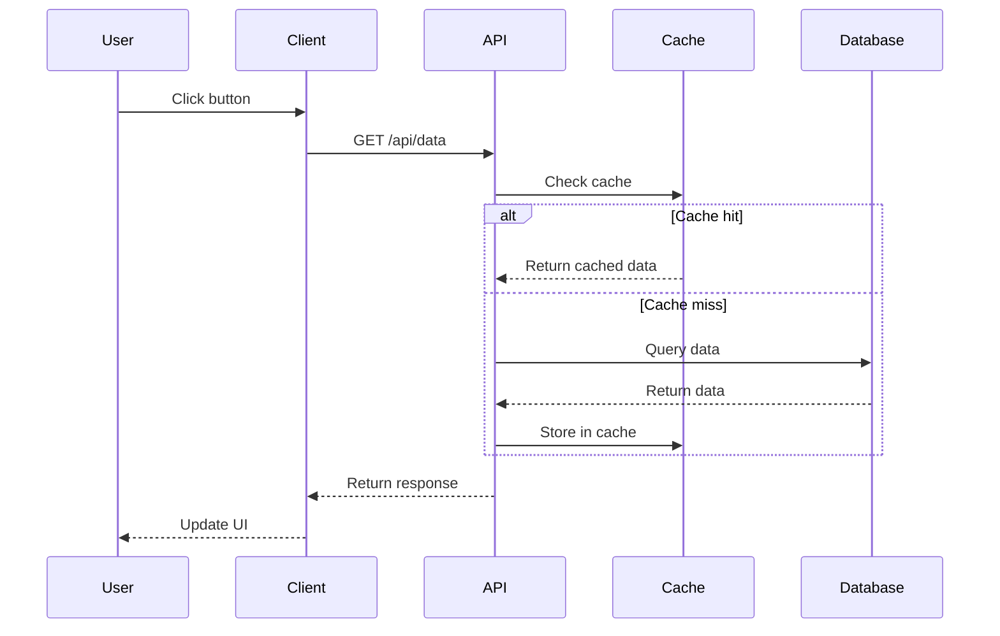

# Documentation Templates

Complete templates for common documentation types. Use these as starting points and customize for your specific project.

## README.md Template

````markdown
# Project Name

Brief one-sentence description of what this project does.

[](LICENSE.md)
[](#)

## Overview

A more detailed description of the project, its purpose, and key features. Explain what problem it solves and why someone would want to use it.

### Key Features
- Feature 1
- Feature 2
- Feature 3

## Tech Stack

| Category | Technology |
|----------|-----------|
| Backend  | Node.js, Express |
| Frontend | React, TypeScript |
| Database | PostgreSQL |
| Deployment | Docker, AWS |

## Getting Started

### Prerequisites

Before you begin, ensure you have the following installed:
- Node.js (v18 or higher)
- npm or yarn
- PostgreSQL (v14 or higher)
- Git

### Installation

1. Clone the repository:
```bash
git clone https://github.com/username/project-name.git
cd project-name
```

2. Install dependencies:
```bash
npm install
```

3. Set up environment variables:
```bash
cp .env.example .env
# Edit .env with your configuration
```

4. Set up the database:
```bash
npm run db:migrate
npm run db:seed
```

5. Start the development server:
```bash
npm run dev
```

The application should now be running at `http://localhost:3000`.

### Configuration

1. Copy the environment file:
```bash
cp .env.example .env
```

2. Edit `.env` and configure required variables:
| Variable | Description | Required |
|----------|-------------|----------|
| `DATABASE_URL` | Database connection string | Yes |
| `API_KEY` | External service API key | Yes |
| `PORT` | Server port | No (default: 3000) |

### Alternative Installation (Docker)

```bash
docker-compose up -d
```

## Architecture

Brief overview of the system architecture, key components, and design decisions.

```
┌─────────────┐
│   Client    │
│  (Browser)  │
└──────┬──────┘
       │ HTTPS
       ▼
┌─────────────┐      ┌─────────────┐
│  API Server │◄────►│  Database   │
│  (Node.js)  │      │ (PostgreSQL)│
└──────┬──────┘      └─────────────┘
       │
       ▼
┌─────────────┐
│  External   │
│  Services   │
└─────────────┘
```

See [Architecture Documentation](./docs/ARCHITECTURE.md) for detailed design decisions, component relationships, and data flow.

## Project Structure

```
project-name/
├── src/              # Source code
│   ├── components/   # React components
│   ├── utils/        # Utility functions
│   └── api/          # API endpoints
├── tests/            # Test files
├── docs/             # Documentation
├── public/           # Static assets
└── config/           # Configuration files
```

## Cloud Resources

Cloud services and infrastructure used by this project:

| Resource | Purpose | Environment |
|----------|---------|-------------|
| AWS S3 | File storage | Production, Staging |
| Redis | Caching & sessions | All |
| AWS Lambda | Background jobs | Production |

See [Cloud Resources](./docs/INFRASTRUCTURE/CLOUD_RESOURCES.md) for complete infrastructure documentation.

## Troubleshooting

Common issues and solutions:

**Issue**: Port already in use
```bash
# Solution: Kill the process or use a different port
npm run dev -- --port 3001
```

See [TROUBLESHOOTING.md](./docs/TROUBLESHOOTING.md) for more issues.

## References

- [Architecture Documentation](./docs/ARCHITECTURE.md)
- [API Documentation](./docs/API_DOCUMENTATION.md)
- [Official Framework Docs](https://framework.example.com)
- [Related Blog Post](https://blog.example.com/article)

*Last Updated: DD Mon YYYY*
````

## CHANGELOG.md Template

````markdown
# Changelog

All notable changes to this project will be documented in this file.

The format is based on [Keep a Changelog](https://keepachangelog.com/en/1.0.0/),
and this project adheres to [Semantic Versioning](https://semver.org/spec/v2.0.0.html).

## [Unreleased]

### Added
- New feature description
- Another new feature

### Changed
- Modified behavior description

### Deprecated
- Feature that will be removed in next major version

### Removed
- Feature that was removed

### Fixed
- Bug fix description

### Security
- Security-related changes

## [1.2.0] - 2024-01-15

### Added
- User authentication system (#45)
- Dark mode support (#48)
- Export to PDF feature (#52)

### Changed
- Improved performance of search by 50% (#47)
- Updated dependencies to latest versions

### Fixed
- Fixed memory leak in data processing (#50)
- Resolved race condition in async operations (#51)

## [1.1.0] - 2024-01-01

### Added
- Dashboard widgets customization
- Real-time notifications
- API rate limiting

### Changed
- Refactored database queries for better performance
- Updated UI components to new design system

### Deprecated
- Legacy authentication method (will be removed in v2.0.0)

### Fixed
- Fixed timezone handling in date picker
- Resolved CSS alignment issues on mobile

## [1.0.0] - 2023-12-01

### Added
- Initial release
- Core functionality
- User management system
- REST API
- Documentation

[Unreleased]: https://github.com/username/project/compare/v1.2.0...HEAD
[1.2.0]: https://github.com/username/project/compare/v1.1.0...v1.2.0
[1.1.0]: https://github.com/username/project/compare/v1.0.0...v1.1.0
[1.0.0]: https://github.com/username/project/releases/tag/v1.0.0

## References

- [Keep a Changelog](https://keepachangelog.com/)
- [Semantic Versioning](https://semver.org/)
- [Git Tagging Guide](https://git-scm.com/book/en/v2/Git-Basics-Tagging)

*Last Updated: DD Mon YYYY*
````

## CONTRIBUTING.md Template

````markdown
# Contributing

Thank you for your interest in contributing to Project Name! This document provides guidelines and instructions for contributing.

## Code of Conduct

By participating in this project, you agree to abide by our [Code of Conduct](CODE_OF_CONDUCT.md).

## How Can I Contribute?

### Reporting Bugs

Before creating bug reports, please check the [issue tracker](https://github.com/username/project/issues) to see if the issue has already been reported.

**How to submit a good bug report:**
- Use a clear and descriptive title
- Describe the exact steps to reproduce the problem
- Provide specific examples (code, screenshots, etc.)
- Describe the behavior you observed and what you expected
- Include system details (OS, browser, version)

**Bug report template:**
```markdown
**Describe the bug**
A clear description of what the bug is.

**To Reproduce**
Steps to reproduce the behavior:
1. Go to '...'
2. Click on '....'
3. See error

**Expected behavior**
What you expected to happen.

**Screenshots**
If applicable, add screenshots.

**Environment:**
 - OS: [e.g. Windows 11]
 - Browser: [e.g. Chrome 120]
 - Version: [e.g. 1.2.3]
```

### Suggesting Enhancements

Enhancement suggestions are welcome! Please provide:
- Clear description of the enhancement
- Why it would be useful
- Possible implementation approach
- Any relevant examples or mockups

### Submitting Pull Requests

1. Fork the repository
2. Create a feature branch: `git checkout -b feature/amazing-feature`
3. Make your changes
4. Add tests for new functionality
5. Ensure all tests pass: `npm test`
6. Commit your changes: `git commit -m 'feat: add amazing feature'`
7. Push to the branch: `git push origin feature/amazing-feature`
8. Open a Pull Request

**Pull Request Guidelines:**
- Keep PRs focused on a single change
- Write clear commit messages following [Conventional Commits](https://www.conventionalcommits.org/)
- Update documentation if needed
- Add tests for new features
- Ensure CI/CD passes

## Development Setup

### Prerequisites
- Node.js v18+
- npm or yarn
- Git

### Getting the Code

```bash
git clone https://github.com/YOUR_USERNAME/project-name.git
cd project-name
npm install
```

### Running Locally

```bash
npm run dev
```

### Running Tests

```bash
npm test
npm run test:coverage
```

## Coding Standards

### Code Style

We use ESLint and Prettier for code formatting:

```bash
npm run lint          # Check for linting issues
npm run lint:fix      # Auto-fix linting issues
npm run format        # Format code with Prettier
```

### Naming Conventions

- **Files**: `kebab-case.ts` (e.g., `user-service.ts`)
- **Variables/Functions**: `camelCase` (e.g., `getUserById`)
- **Classes**: `PascalCase` (e.g., `UserService`)
- **Constants**: `UPPER_SNAKE_CASE` (e.g., `MAX_RETRY_COUNT`)
- **Types/Interfaces**: `PascalCase` (e.g., `UserProfile`)

### Commit Messages

Follow [Conventional Commits](https://www.conventionalcommits.org/):

```
<type>(<scope>): <description>

[optional body]

[optional footer(s)]
```

**Types:**
- `feat`: New feature
- `fix`: Bug fix
- `docs`: Documentation only
- `style`: Code style changes (formatting, etc.)
- `refactor`: Code refactoring
- `test`: Adding or updating tests
- `chore`: Maintenance tasks

**Examples:**
```
feat(auth): add OAuth2 authentication support
fix(api): resolve race condition in user lookup
docs(readme): update installation instructions
```

## Testing Guidelines

### Test Coverage

We aim for 80%+ code coverage. Run coverage report:

```bash
npm run test:coverage
```

### Writing Tests

- Write unit tests for all new functions
- Write integration tests for API endpoints
- Write E2E tests for critical user flows
- Use descriptive test names
- Follow Arrange-Act-Assert pattern

**Example:**
```javascript
describe('UserService', () => {
  describe('getUserById', () => {
    it('should return user when valid ID provided', async () => {
      // Arrange
      const userId = 123;
      const expectedUser = { id: 123, name: 'John' };
      
      // Act
      const result = await userService.getUserById(userId);
      
      // Assert
      expect(result).toEqual(expectedUser);
    });
  });
});
```

## Documentation

### Updating Documentation

- Update README.md for user-facing changes
- Update inline code comments for complex logic
- Update API documentation for endpoint changes
- Add JSDoc comments for public functions

### Documentation Style

- Use clear, concise language
- Include code examples
- Add diagrams for complex concepts
- Keep examples up-to-date

## Review Process

All submissions require review before merging:

1. **Automated checks**: CI/CD must pass
2. **Code review**: At least one maintainer approval
3. **Documentation review**: Ensure docs are updated
4. **Final merge**: Maintainer will merge approved PRs

## Questions?

Feel free to reach out:
- Open an issue for questions
- Join our [Discord](https://discord.gg/example)
- Email: contributors@example.com

## License

By contributing, you agree that your contributions will be licensed under the project's [MIT License](LICENSE.md).

## References

- [Conventional Commits](https://www.conventionalcommits.org/)
- [Semantic Versioning](https://semver.org/)
- [GitHub Flow](https://guides.github.com/introduction/flow/)
- [How to Contribute to Open Source](https://opensource.guide/how-to-contribute/)

*Last Updated: DD Mon YYYY*
````

## ARCHITECTURE.md Template

````markdown
# Architecture

This document describes the high-level architecture of Project Name, including design decisions, component relationships, and system flow.

## Overview

Project Name is a [brief description] built using [architecture pattern] to [achieve goal]. The system consists of [number] main components that work together to [main functionality].

## Architecture Diagram

```
┌─────────────┐
│   Client    │
│  (Browser)  │
└──────┬──────┘
       │ HTTPS
       ▼
┌─────────────┐      ┌─────────────┐
│  Load       │      │   Cache     │
│  Balancer   │◄────►│  (Redis)    │
└──────┬──────┘      └─────────────┘
       │
       ▼
┌─────────────┐      ┌─────────────┐
│  API        │      │  Message    │
│  Server     │─────►│  Queue      │
│  (Node.js)  │      │  (RabbitMQ) │
└──────┬──────┘      └──────┬──────┘
       │                    │
       ▼                    ▼
┌─────────────┐      ┌─────────────┐
│  Database   │      │  Worker     │
│  (PostgreSQL)│      │  Process    │
└─────────────┘      └─────────────┘
```

## Design Principles

Our architecture is guided by these principles:

1. **Scalability**: Components can scale independently
2. **Reliability**: System handles failures gracefully
3. **Maintainability**: Clear separation of concerns
4. **Performance**: Optimized for low latency
5. **Security**: Defense in depth approach

## Components

### Client Layer

**Purpose**: User interface and interaction
**Technology**: React, TypeScript
**Responsibilities**:
- Render UI components
- Handle user input
- Manage client-side state
- Communicate with API layer

**Key Design Decisions**:
- Single Page Application (SPA) for better UX
- Component-based architecture for reusability
- Redux for state management

### API Layer

**Purpose**: Business logic and data access
**Technology**: Node.js, Express
**Responsibilities**:
- Validate requests
- Execute business logic
- Coordinate with services
- Format responses

**Key Design Decisions**:
- RESTful API for simplicity
- Stateless for horizontal scaling
- JWT for authentication
- Rate limiting for protection

### Data Layer

**Purpose**: Persistent data storage
**Technology**: PostgreSQL
**Responsibilities**:
- Store application data
- Ensure data integrity
- Provide query capabilities
- Handle transactions

**Key Design Decisions**:
- Relational database for ACID compliance
- Indexes for query performance
- Read replicas for scalability
- Automated backups for safety

### Cache Layer

**Purpose**: Performance optimization
**Technology**: Redis
**Responsibilities**:
- Cache frequently accessed data
- Store session information
- Reduce database load
- Improve response times

**Key Design Decisions**:
- TTL-based cache invalidation
- Cache-aside pattern
- Distributed cache for scaling

## Data Flow

### Typical Request Flow

1. **User Action**: User interacts with client
2. **Client Request**: Client sends HTTP request to API
3. **Authentication**: API validates JWT token
4. **Validation**: API validates request data
5. **Business Logic**: API executes business rules
6. **Data Access**: API queries database (or cache)
7. **Response**: API formats and returns response
8. **Client Update**: Client updates UI



## Security Architecture

### Authentication
- JWT tokens for stateless authentication
- Refresh tokens for extended sessions
- OAuth2 for third-party providers

### Authorization
- Role-based access control (RBAC)
- Permission checks at API layer
- Resource-level permissions

### Data Protection
- HTTPS for all communication
- Encryption at rest for sensitive data
- Input validation and sanitization
- SQL injection prevention

## Scalability

### Horizontal Scaling
- Stateless API servers
- Load balancer distribution
- Database read replicas
- Distributed caching

### Vertical Scaling
- Increase server resources
- Database optimization
- Connection pooling

### Bottlenecks
- Database: Use caching and read replicas
- API: Add more instances behind load balancer
- Cache: Implement cache sharding

## Monitoring and Observability

### Metrics
- Request rate and latency
- Error rates and types
- Resource utilization
- Business metrics

### Logging
- Structured logging (JSON)
- Correlation IDs for tracing
- Log levels (debug, info, warn, error)
- Centralized log aggregation

### Alerting
- Error rate thresholds
- Latency SLAs
- Resource limits
- Business metric anomalies

## Deployment Architecture

```
┌─────────────────┐
│   Production    │
│   Environment   │
├─────────────────┤
│ • 3 API servers │
│ • 2 DB replicas │
│ • Redis cluster │
│ • Load balancer │
└─────────────────┘
         ▲
         │
┌─────────────────┐
│   Staging       │
│   Environment   │
├─────────────────┤
│ • 1 API server  │
│ • 1 DB instance │
│ • Redis         │
└─────────────────┘
```

### Environments
- **Development**: Local development
- **Staging**: Pre-production testing
- **Production**: Live environment

### CI/CD Pipeline
1. Code commit triggers build
2. Automated tests run
3. Docker image created
4. Deploy to staging
5. Integration tests
6. Manual approval
7. Deploy to production

## Technology Decisions

### Why Node.js?
- JavaScript across the stack
- Excellent async I/O
- Large ecosystem
- Good performance for I/O-bound apps

### Why PostgreSQL?
- ACID compliance
- Advanced features (JSON, full-text search)
- Strong community
- Proven reliability

### Why React?
- Component reusability
- Virtual DOM performance
- Large ecosystem
- Strong community support

## Future Considerations

### Planned Enhancements
- GraphQL API for flexible queries
- Microservices architecture
- Event sourcing for audit trail
- Machine learning integration

### Technical Debt
- Legacy authentication system
- Unoptimized database queries
- Missing test coverage in module X

## References

- [API Documentation](./API_DOCUMENTATION.md)
- [Database Schema](./DATABASE_SCHEMA.md)
- [Deployment Guide](./DEPLOYMENT.md)
- [The Twelve-Factor App](https://12factor.net/)
- [Martin Fowler's Architecture Articles](https://martinfowler.com/architecture/)

*Last Updated: DD Mon YYYY*
````

## API_DOCUMENTATION.md Template

````markdown
# API Documentation

Complete reference for the Project Name REST API.

## Base URL

```
Production: https://api.example.com/v1
Staging: https://api-staging.example.com/v1
```

## Authentication

All API requests require authentication via Bearer token:

```bash
Authorization: Bearer YOUR_ACCESS_TOKEN
```

### Getting a Token

```http
POST /auth/login
Content-Type: application/json

{
  "email": "user@example.com",
  "password": "password123"
}
```

**Response:**
```json
{
  "access_token": "eyJhbGciOiJIUzI1NiIsInR5cCI6IkpXVCJ9...",
  "refresh_token": "eyJhbGciOiJIUzI1NiIsInR5cCI6IkpXVCJ9...",
  "expires_in": 3600
}
```

## Rate Limiting

API requests are limited to:
- 100 requests per minute per user
- 1000 requests per minute per IP

Rate limit headers included in response:
```
X-RateLimit-Limit: 100
X-RateLimit-Remaining: 95
X-RateLimit-Reset: 1640995200
```

## Response Format

All responses follow this structure:

**Success:**
```json
{
  "status": "success",
  "data": { ... },
  "meta": {
    "page": 1,
    "limit": 20,
    "total": 100
  }
}
```

**Error:**
```json
{
  "status": "error",
  "code": "VALIDATION_ERROR",
  "message": "Invalid input data",
  "errors": [
    {
      "field": "email",
      "message": "Invalid email format"
    }
  ]
}
```

## Endpoints

### Users

#### Get User
```http
GET /users/:id
```

**Parameters:**
| Name | Type | Required | Description |
|------|------|----------|-------------|
| id   | int  | Yes      | User ID     |

**Response:**
```json
{
  "status": "success",
  "data": {
    "id": 123,
    "email": "user@example.com",
    "name": "John Doe",
    "created_at": "2024-01-15T10:30:00Z"
  }
}
```

#### Create User
```http
POST /users
```

**Request Body:**
```json
{
  "email": "user@example.com",
  "password": "securePassword123",
  "name": "John Doe"
}
```

**Response:** `201 Created`
```json
{
  "status": "success",
  "data": {
    "id": 124,
    "email": "user@example.com",
    "name": "John Doe"
  }
}
```

#### Update User
```http
PATCH /users/:id
```

**Request Body:**
```json
{
  "name": "Jane Doe"
}
```

#### Delete User
```http
DELETE /users/:id
```

**Response:** `204 No Content`

### Projects

#### List Projects
```http
GET /projects
```

**Query Parameters:**
| Name | Type | Required | Description |
|------|------|----------|-------------|
| page | int  | No       | Page number (default: 1) |
| limit | int | No       | Items per page (default: 20) |
| status | string | No    | Filter by status |

**Example:**
```
GET /projects?page=2&limit=10&status=active
```

#### Get Project
```http
GET /projects/:id
```

## Error Codes

| Code | Description |
|------|-------------|
| 400  | Bad Request - Invalid parameters |
| 401  | Unauthorized - Invalid or missing token |
| 403  | Forbidden - Insufficient permissions |
| 404  | Not Found - Resource doesn't exist |
| 429  | Too Many Requests - Rate limit exceeded |
| 500  | Internal Server Error |

## Pagination

Paginated endpoints support:
- `page`: Page number (starts at 1)
- `limit`: Items per page (max 100)

**Response includes:**
```json
{
  "meta": {
    "page": 1,
    "limit": 20,
    "total": 100,
    "pages": 5
  }
}
```

## Filtering and Sorting

### Filtering
Use query parameters to filter results:
```
GET /users?status=active&role=admin
```

### Sorting
Use `sort` parameter:
```
GET /users?sort=created_at,desc
GET /users?sort=name,asc
```

## Webhooks

Configure webhooks to receive real-time notifications:

**Supported events:**
- `user.created`
- `user.updated`
- `user.deleted`
- `project.created`

**Webhook payload:**
```json
{
  "event": "user.created",
  "timestamp": "2024-01-15T10:30:00Z",
  "data": {
    "id": 123,
    "email": "user@example.com"
  }
}
```

## SDKs and Tools

- **JavaScript**: `npm install @example/sdk`
- **Python**: `pip install example-sdk`
- **Go**: `go get github.com/example/sdk-go`

## References

- [Authentication Guide](./AUTHENTICATION.md)
- [Webhook Documentation](./WEBHOOKS.md)
- [OpenAPI Specification](./openapi.yaml)
- [Postman Collection](./postman_collection.json)

*Last Updated: DD Mon YYYY*
````

## TESTING.md Template

````markdown
# Testing

Comprehensive guide for testing Project Name, including strategies, tools, and best practices.

## Testing Strategy

We use a multi-layered testing approach:

```
┌─────────────────────┐
│  E2E Tests (10%)    │  ← User workflows
├─────────────────────┤
│  Integration (20%)  │  ← Component interactions
├─────────────────────┤
│  Unit Tests (70%)   │  ← Individual functions
└─────────────────────┘
```

### Test Coverage Goals
- **Unit Tests**: 80%+ code coverage
- **Integration Tests**: All API endpoints
- **E2E Tests**: Critical user journeys

## Test Types

### Unit Tests

**Purpose**: Test individual functions and methods in isolation
**Tools**: Jest, React Testing Library
**Location**: `tests/unit/` or `__tests__/`

**Example:**
```javascript
describe('calculateTotal', () => {
  it('should calculate total with tax', () => {
    const items = [{ price: 100 }, { price: 200 }];
    const taxRate = 0.1;
    
    const result = calculateTotal(items, taxRate);
    
    expect(result).toBe(330);
  });

  it('should handle empty items array', () => {
    const result = calculateTotal([], 0.1);
    expect(result).toBe(0);
  });
});
```

**Run unit tests:**
```bash
npm test
npm test -- --watch
npm test -- --coverage
```

### Integration Tests

**Purpose**: Test interactions between components
**Tools**: Supertest, Testing Library
**Location**: `tests/integration/`

**Example:**
```javascript
describe('POST /api/users', () => {
  it('should create a new user', async () => {
    const userData = {
      email: 'test@example.com',
      password: 'password123'
    };

    const response = await request(app)
      .post('/api/users')
      .send(userData)
      .expect(201);

    expect(response.body.email).toBe(userData.email);
    
    const user = await User.findOne({ email: userData.email });
    expect(user).toBeDefined();
  });
});
```

**Run integration tests:**
```bash
npm run test:integration
```

### End-to-End Tests

**Purpose**: Test complete user workflows
**Tools**: Playwright, Cypress
**Location**: `tests/e2e/`

**Example:**
```javascript
describe('User Login Flow', () => {
  it('should login successfully', async () => {
    await page.goto('http://localhost:3000/login');
    
    await page.fill('[data-testid=email]', 'user@example.com');
    await page.fill('[data-testid=password]', 'password123');
    await page.click('[data-testid=submit]');
    
    await expect(page).toHaveURL('/dashboard');
    await expect(page.locator('[data-testid=welcome]'))
      .toContainText('Welcome');
  });
});
```

**Run E2E tests:**
```bash
npm run test:e2e
```

## Running Tests

### All Tests
```bash
npm test
```

### Specific Test Types
```bash
npm run test:unit
npm run test:integration
npm run test:e2e
```

### Watch Mode
```bash
npm test -- --watch
```

### Coverage Report
```bash
npm run test:coverage
```

View coverage report: `coverage/lcov-report/index.html`

## Test Organization

```
project/
├── src/
│   ├── utils/
│   │   └── calculateTotal.js
│   └── components/
│       └── UserCard.jsx
├── tests/
│   ├── unit/
│   │   ├── utils/
│   │   │   └── calculateTotal.test.js
│   │   └── components/
│   │       └── UserCard.test.jsx
│   ├── integration/
│   │   └── api/
│   │       └── users.test.js
│   └── e2e/
│       ├── login.spec.js
│       └── checkout.spec.js
└── fixtures/
    └── test-data.json
```

## Writing Good Tests

### Test Structure (AAA Pattern)

```javascript
it('should do something', () => {
  // Arrange - Set up test data and conditions
  const input = createTestData();
  
  // Act - Execute the code being tested
  const result = functionUnderTest(input);
  
  // Assert - Verify the results
  expect(result).toBe(expectedValue);
});
```

### Test Naming

**Good:**
```javascript
describe('UserService', () => {
  describe('createUser', () => {
    it('should create user with valid data', () => { });
    it('should throw error when email already exists', () => { });
    it('should hash password before saving', () => { });
  });
});
```

**Bad:**
```javascript
describe('User', () => {
  it('works', () => { });
  it('test', () => { });
});
```

### Test Data

Use fixtures for test data:

```javascript
// fixtures/users.js
export const validUser = {
  email: 'test@example.com',
  password: 'password123',
  name: 'Test User'
};

export const invalidUser = {
  email: 'invalid-email',
  password: '123'
};
```

### Mocking

Mock external dependencies:

```javascript
jest.mock('../services/emailService');

it('should send welcome email', async () => {
  const emailService = require('../services/emailService');
  emailService.sendWelcomeEmail.mockResolvedValue(true);
  
  await userService.createUser(userData);
  
  expect(emailService.sendWelcomeEmail)
    .toHaveBeenCalledWith(userData.email);
});
```

## Continuous Integration

Tests run automatically on every PR:

```yaml
# .github/workflows/test.yml
name: Tests
on: [push, pull_request]
jobs:
  test:
    runs-on: ubuntu-latest
    steps:
      - uses: actions/checkout@v3
      - run: npm install
      - run: npm test
      - run: npm run test:coverage
```

## Debugging Tests

### Debug Mode
```bash
npm test -- --debug
```

### Only Run Failed Tests
```bash
npm test -- --onlyFailures
```

### Verbose Output
```bash
npm test -- --verbose
```

## Common Testing Patterns

### Testing Async Code
```javascript
it('should fetch data', async () => {
  const result = await fetchData();
  expect(result).toBeDefined();
});
```

### Testing Components
```javascript
it('should render user name', () => {
  render(<UserCard user={{ name: 'John' }} />);
  expect(screen.getByText('John')).toBeInTheDocument();
});
```

### Testing Error Handling
```javascript
it('should throw error for invalid input', () => {
  expect(() => {
    processInput(null);
  }).toThrow('Input is required');
});
```

## Performance Testing

### Load Testing
```bash
npm run test:load
```

Tools: Artillery, k6

### Benchmarking
```javascript
suite('Array Operations', () => {
  benchmark('map', () => {
    array.map(x => x * 2);
  });
  
  benchmark('forEach', () => {
    array.forEach(x => x * 2);
  });
});
```

## References

- [Jest Documentation](https://jestjs.io/)
- [Testing Library](https://testing-library.com/)
- [Playwright](https://playwright.dev/)
- [Test-Driven Development Guide](https://martinfowler.com/bliki/TestDrivenDevelopment.html)

*Last Updated: DD Mon YYYY*
````

## STACK.md Template

````markdown
# Stack

Overview of all technologies, tools, and services used in this project.

## Overview

This document lists all technology choices, third-party services, development tools, and infrastructure components used across the project. It serves as a single source of truth for the tech stack.

## Frontend

| Technology | Version | Purpose |
|------------|---------|---------|
| React | 18.x | UI framework |
| TypeScript | 5.x | Type safety |
| Vite | 5.x | Build tool |
| Tailwind CSS | 3.x | Styling |

## Backend

| Technology | Version | Purpose |
|------------|---------|---------|
| Node.js | 20.x | Runtime |
| Express | 4.x | Web framework |
| TypeScript | 5.x | Type safety |

## Database

| Technology | Version | Purpose |
|------------|---------|---------|
| PostgreSQL | 15.x | Primary database |
| Redis | 7.x | Caching & sessions |

## Infrastructure and DevOps

| Technology | Version | Purpose |
|------------|---------|---------|
| Docker | Latest | Containerization |
| GitHub Actions | N/A | CI/CD |
| AWS | N/A | Cloud hosting |

## Development Tools

| Tool | Purpose |
|------|---------|
| ESLint | Code linting |
| Prettier | Code formatting |
| Jest | Unit testing |
| Playwright | E2E testing |

## External Services

| Service | Purpose | Environment |
|---------|---------|-------------|
| Stripe | Payments | Production |
| SendGrid | Emails | All |
| Sentry | Error tracking | Production, Staging |

## Rationale

### Why React?
[Explain the decision for key technology choices]

### Why PostgreSQL?
[Explain database choice]

## Adding New Dependencies

Before adding a new dependency:
1. Check if a built-in alternative exists
2. Evaluate bundle size impact
3. Review license compatibility
4. Document the decision in an ADR if significant

## References

- [Architecture Documentation](./ARCHITECTURE.md)
- [Dependencies](./DEPENDENCIES.md)
- [External Services](./EXTERNAL_SERVICES.md)
- [Project Structure](./PROJECT_STRUCTURE.md)

*Last Updated: DD Mon YYYY*
````

## PROJECT_STRUCTURE.md Template

````markdown
# Project Structure

Overview of the project's directory layout and organization.

## Overview

This document describes the folder structure, file organization patterns, and the purpose of each directory in the project.

## Directory Tree

```
project-name/
├── .github/            # GitHub workflows and templates
├── docs/               # Project documentation
├── src/
│   ├── components/     # Reusable UI components
│   ├── features/       # Feature-specific modules
│   ├── hooks/          # Custom React hooks
│   ├── services/       # API and business logic
│   ├── stores/         # State management
│   ├── utils/          # Utility functions
│   └── types/          # TypeScript type definitions
├── tests/
│   ├── unit/           # Unit tests
│   ├── integration/    # Integration tests
│   └── e2e/            # End-to-end tests
├── public/             # Static assets
├── config/             # Configuration files
└── scripts/            # Build and utility scripts
```

## Directory Descriptions

### `src/components/`
Reusable UI components that are not tied to specific features.

- Follow atomic design principles
- Each component has its own directory with `.tsx`, `.test.tsx`, and `.styles.ts`

### `src/features/`
Feature-specific modules containing components, logic, and state.

- Co-locate feature code (components, hooks, stores)
- Each feature is self-contained

### `src/services/`
API clients, external service integrations, and business logic.

- Abstract external APIs behind service interfaces
- Handle error handling and retry logic here

### `src/utils/`
Pure utility functions and helpers.

- No side effects
- Well-tested
- Documented with JSDoc

## File Naming Conventions

| File Type | Pattern | Example |
|-----------|---------|---------|
| Components | `PascalCase.tsx` | `UserCard.tsx` |
| Hooks | `camelCase.ts` | `useAuth.ts` |
| Services | `camelCase.ts` | `userService.ts` |
| Utils | `camelCase.ts` | `formatDate.ts` |
| Tests | `*.test.ts` | `UserCard.test.tsx` |

## Adding New Directories

When creating a new top-level directory:
1. Document the purpose in this file
2. Update the directory tree above
3. Add a section describing its contents
4. Define naming conventions for files within it

## References

- [Naming Conventions](./NAMING_CONVENTIONS.md)
- [Architecture Documentation](./ARCHITECTURE.md)
- [Stack](./STACK.md)

*Last Updated: DD Mon YYYY*
````

## EXTERNAL_SERVICES.md Template

````markdown
# External Services

Documentation of all third-party services and APIs integrated with this project.

## Overview

This document lists all external services the application depends on, their purpose, how they are integrated, and what happens if they become unavailable.

## Services

### Stripe

**Purpose:** Payment processing
**Environment:** Production, Staging
**Integration:** REST API via `@stripe/stripe-js`
**Data Flow:**
1. Frontend collects payment details
2. Stripe tokenizes card information
3. Backend creates charge using Stripe API
4. Webhook confirms payment status

**Configuration:**
| Variable | Description |
|----------|-------------|
| `STRIPE_PUBLIC_KEY` | Publishable key |
| `STRIPE_SECRET_KEY` | Secret key |
| `STRIPE_WEBHOOK_SECRET` | Webhook verification |

**Fallback Behavior:**
- Payment form shows error message
- Order is marked as pending

### SendGrid

**Purpose:** Transactional and marketing emails
**Environment:** All
**Integration:** REST API via `@sendgrid/mail`

**Configuration:**
| Variable | Description |
|----------|-------------|
| `SENDGRID_API_KEY` | API key for sending emails |

**Fallback Behavior:**
- Emails queued for retry
- Admin notified of delivery failures

### Sentry

**Purpose:** Error tracking and performance monitoring
**Environment:** Production, Staging
**Integration:** SDK `@sentry/react`

**Configuration:**
| Variable | Description |
|----------|-------------|
| `SENTRY_DSN` | Project DSN |

## Service Health Check

```bash
# Test external service connectivity
npm run check:services
```

## Adding a New Service

1. Document the service in this file
2. Add environment variables to `.env.example`
3. Add configuration validation
4. Implement health check
5. Define fallback behavior
6. Update architecture diagrams

## References

- [Architecture Documentation](./ARCHITECTURE.md)
- [Stack](./STACK.md)
- [Configuration](./CONFIGURATION.md)
- [Service Status Dashboard](https://status.example.com)

*Last Updated: DD Mon YYYY*
````

## TESTING_TOOLS.md Template

````markdown
# Testing Tools

Overview of the testing infrastructure, tools, and strategies used in this project.

## Overview

This document describes the testing approach, tools, and how to execute tests for the project.

## Test Types

| Type | Tool | Location | Goal |
|------|------|----------|------|
| Unit | Jest | `tests/unit/` | 80%+ coverage |
| Integration | Supertest | `tests/integration/` | All API endpoints |
| E2E | Playwright | `tests/e2e/` | Critical user journeys |

## Running Tests

### All Tests
```bash
npm test
```

### Unit Tests
```bash
npm run test:unit
```

### Integration Tests
```bash
npm run test:integration
```

### E2E Tests
```bash
npm run test:e2e
```

### Coverage Report
```bash
npm run test:coverage
```

## CI/CD Integration

Tests run automatically:
- On every Pull Request
- Before deployment to staging
- Daily scheduled full regression suite

## Test Data

Test fixtures located in `tests/fixtures/`:
- `users.json` — Sample user data
- `products.json` — Sample product data

## Mocking External Services

Use `tests/mocks/` for:
- API client mocks
- Third-party service stubs
- Database seed data

## References

- [Testing Strategy](./TESTING.md)
- [Contributing Guide](../CONTRIBUTING.md)
- [CI/CD Workflows](./INFRASTRUCTURE/WORKFLOWS.md)

*Last Updated: DD Mon YYYY*
````

## WORKFLOWS.md Template

````markdown
# Workflows

Documentation of continuous integration and deployment pipelines.

## Overview

This document describes the GitHub Actions workflows, deployment processes, and automation configured for this project.

## Workflows

### `ci.yml` — Continuous Integration

**Trigger:** Pull requests to `main`, pushes to `main`
**Purpose:** Run tests, lint, and build verification

```yaml
name: CI
on:
  pull_request:
    branches: [main]
  push:
    branches: [main]

jobs:
  test:
    runs-on: ubuntu-latest
    steps:
      - uses: actions/checkout@v4
      - uses: actions/setup-node@v4
        with:
          node-version: '20'
      - run: npm ci
      - run: npm run lint
      - run: npm test
      - run: npm run build
```

### `deploy-staging.yml` — Deploy to Staging

**Trigger:** Push to `develop` branch
**Purpose:** Deploy to staging environment for QA

**Steps:**
1. Run full test suite
2. Build Docker image
3. Push to staging registry
4. Deploy to staging Kubernetes cluster
5. Run smoke tests

### `deploy-production.yml` — Deploy to Production

**Trigger:** Manual trigger or tag push
**Purpose:** Deploy to production with approval

**Steps:**
1. Require manual approval
2. Run full regression suite
3. Build and tag release image
4. Deploy using blue-green strategy
5. Run production smoke tests
6. Notify team via Slack

## Environments

| Environment | URL | Purpose | Auto-deploy |
|-------------|-----|---------|-------------|
| Development | `http://localhost:3000` | Local development | N/A |
| Staging | `https://staging.example.com` | QA and testing | From `develop` |
| Production | `https://example.com` | Live application | Manual only |

## Deployment Process

1. Create a release branch from `main`
2. Bump version in `package.json`
3. Update `CHANGELOG.md`
4. Open PR with release notes
5. After approval and merge, tag the release
6. Production deployment triggers automatically from tag

## Rollback Procedure

If a deployment causes issues:

```bash
# Rollback to previous version
kubectl rollout undo deployment/app

# Or revert to previous image tag
docker pull registry/app:previous-tag
kubectl set image deployment/app app=registry/app:previous-tag
```

## Required Secrets

Configure these in GitHub repository settings:

| Secret | Purpose |
|--------|---------|
| `DOCKER_USERNAME` | Registry authentication |
| `DOCKER_PASSWORD` | Registry authentication |
| `KUBE_CONFIG` | Kubernetes cluster access |
| `SLACK_WEBHOOK` | Deployment notifications |

## References

- [Deployment Guide](./DEPLOYMENT.md)
- [Cloud Resources](./CLOUD_RESOURCES.md)
- [GitHub Actions Docs](https://docs.github.com/en/actions)

*Last Updated: DD Mon YYYY*
````

## CLOUD_RESOURCES.md Template

````markdown
# Cloud Resources

Documentation of all cloud infrastructure and resources used by this project.

## Overview

This document describes the cloud infrastructure, resources, and their purposes. It serves as an inventory for DevOps, cost tracking, and disaster recovery.

## Infrastructure Diagram

```
┌─────────────────────────────────────────┐
│           AWS Account                   │
│  ┌─────────────────────────────────┐    │
│  │         VPC                     │    │
│  │  ┌─────────────┐  ┌───────────┐│    │
│  │  │ EC2 (App)   │  │ RDS (DB)  ││    │
│  │  └─────────────┘  └───────────┘│    │
│  │  ┌─────────────┐  ┌───────────┐│    │
│  │  │ S3 (Files)  │  │ ElastiCache│    │
│  │  └─────────────┘  └───────────┘│    │
│  └─────────────────────────────────┘    │
└─────────────────────────────────────────┘
```

## Compute Resources

| Resource | Type | Purpose | Environment |
|----------|------|---------|-------------|
| App Server | EC2 t3.medium | Application hosting | Production |
| App Server | EC2 t3.small | Application hosting | Staging |

## Database

| Resource | Engine | Instance | Purpose |
|----------|--------|----------|---------|
| Primary DB | PostgreSQL 15 | db.t3.medium | Main database |
| Read Replica | PostgreSQL 15 | db.t3.small | Read queries |

## Storage

| Resource | Type | Purpose |
|----------|------|---------|
| Asset Bucket | S3 Standard | User-uploaded files |
| Log Bucket | S3 Infrequent Access | Application logs |

## Networking

| Resource | Purpose |
|----------|---------|
| VPC | Network isolation |
| Application Load Balancer | Traffic distribution |
| CloudFront CDN | Static asset delivery |

## Security

| Resource | Purpose |
|----------|---------|
| IAM Roles | Service permissions |
| Security Groups | Network access control |
| AWS WAF | Web application firewall |

## Cost Estimates

| Environment | Monthly Estimate |
|-------------|------------------|
| Production | $500/month |
| Staging | $150/month |

## Disaster Recovery

- **RTO (Recovery Time Objective):** 4 hours
- **RPO (Recovery Point Objective):** 1 hour
- **Backups:** Daily automated snapshots, 30-day retention

## Access Control

| Role | Permissions |
|------|-------------|
| DevOps | Full access |
| Developers | Read-only production, full staging |
| QA | Staging only |

## References

- [Deployment Guide](./DEPLOYMENT.md)
- [Architecture Documentation](../ARCHITECTURE.md)
- [AWS Console](https://console.aws.amazon.com)

*Last Updated: DD Mon YYYY*
````

## NAMING_CONVENTIONS.md Template

````markdown
# Naming Conventions

Standards for naming files, variables, functions, and other identifiers in this project.

## Overview

Consistent naming improves readability, maintainability, and makes the codebase predictable for all contributors.

## File and Directory Names

| Item | Convention | Example |
|------|-----------|---------|
| Components | `PascalCase.tsx` | `UserCard.tsx` |
| Pages | `PascalCasePage.tsx` | `LoginPage.tsx` |
| Hooks | `useCamelCase.ts` | `useAuth.ts` |
| Services | `camelCase.ts` | `userService.ts` |
| Utils | `camelCase.ts` | `formatDate.ts` |
| Tests | `*.test.ts` | `UserCard.test.tsx` |
| Constants | `UPPER_SNAKE_CASE` | `MAX_RETRY_COUNT` |
| Types | `PascalCase` | `UserProfile` |

## Variable Names

| Type | Convention | Example |
|------|-----------|---------|
| Boolean | `is/has/can` prefix | `isLoading`, `hasPermission` |
| Array | Plural noun | `users`, `products` |
| Function | Verb + noun | `getUserById`, `handleSubmit` |
| Callback | `on` prefix | `onSubmit`, `onChange` |

## Function Naming

| Pattern | Example |
|---------|---------|
| Fetch/Retrieve | `fetchUsers`, `getUserById` |
| Create | `createUser`, `addItem` |
| Update | `updateProfile`, `editPost` |
| Delete | `deleteUser`, `removeItem` |
| Check/Validate | `isValidEmail`, `hasPermission` |
| Transform | `formatDate`, `parseCSV` |

## API Endpoint Naming

- Use nouns, not verbs: `/users` not `/getUsers`
- Use plural nouns: `/users` not `/user`
- Use kebab-case for multi-word: `/user-profiles`
- Nest related resources: `/users/:id/posts`

## Database Naming

| Item | Convention | Example |
|------|-----------|---------|
| Tables | Plural, snake_case | `user_profiles` |
| Columns | snake_case | `created_at` |
| Indexes | `idx_table_column` | `idx_users_email` |
| Foreign Keys | `fk_table_ref` | `fk_posts_user_id` |

## Git Branch Naming

| Type | Pattern | Example |
|------|---------|---------|
| Feature | `feature/description` | `feature/user-auth` |
| Bug Fix | `fix/description` | `fix/login-error` |
| Hotfix | `hotfix/description` | `hotfix/payment-bug` |
| Release | `release/version` | `release/1.2.0` |

## References

- [Project Structure](./PROJECT_STRUCTURE.md)
- [Stack](./STACK.md)
- [Google TypeScript Style Guide](https://google.github.io/styleguide/tsguide.html)

*Last Updated: DD Mon YYYY*
````

## DESIGN_PRINCIPLES Template

````markdown
# Design Principles

Core architectural and coding principles guiding this project.

## Overview

This document defines the design principles, patterns, and philosophies that shape how we build software in this project.

## SOLID Principles

### Single Responsibility Principle (SRP)
Each class, module, or function should have one reason to change.

**Example:**
```typescript
// Good: Separate responsibilities
class UserService {
  async createUser(data: CreateUserDto) { ... }
}

class EmailService {
  async sendWelcomeEmail(user: User) { ... }
}
```

### Open/Closed Principle (OCP)
Software entities should be open for extension but closed for modification.

### Liskov Substitution Principle (LSP)
Subtypes must be substitutable for their base types.

### Interface Segregation Principle (ISP)
Clients should not be forced to depend on interfaces they do not use.

### Dependency Inversion Principle (DIP)
Depend on abstractions, not concretions.

## DRY (Don't Repeat Yourself)

Every piece of knowledge must have a single, unambiguous representation.

- Extract shared logic into utilities or services
- Use composition over duplication

## KISS (Keep It Simple, Stupid)

Simplicity is the ultimate sophistication.

- Prefer straightforward solutions
- Avoid premature optimization
- Code should be readable by junior developers

## YAGNI (You Aren't Gonna Need It)

Don't implement functionality until it's actually needed.

- Avoid speculative features
- Build for current requirements, not future hypotheticals

## References

- [Clean Code](https://www.oreilly.com/library/view/clean-code/9780136083238/)
- [SOLID Principles](https://en.wikipedia.org/wiki/SOLID)
- [Design Patterns](./DESIGN_PATTERNS)

*Last Updated: DD Mon YYYY*
````

## DESIGN_PATTERNS Template

````markdown
# Design Patterns

Patterns used in this project and when to apply them.

## Overview

This document catalogs the design patterns used in the codebase, their purpose, and examples of correct implementation.

## Creational Patterns

### Factory Pattern

**When to use:** Creating objects without specifying the exact class
**Example:**
```typescript
class NotificationFactory {
  static create(type: string): Notification {
    switch (type) {
      case 'email': return new EmailNotification();
      case 'sms': return new SMSNotification();
      default: throw new Error('Unknown type');
    }
  }
}
```

## Structural Patterns

### Repository Pattern

**When to use:** Abstracting data access logic
**Example:**
```typescript
interface IUserRepository {
  findById(id: string): Promise<User>;
  save(user: User): Promise<void>;
}

class UserRepository implements IUserRepository {
  async findById(id: string): Promise<User> {
    return db.users.findById(id);
  }
}
```

## Behavioral Patterns

### Observer Pattern

**When to use:** Event-driven communication between components
**Example:**
```typescript
class EventEmitter {
  private listeners = new Map<string, Function[]>();

  on(event: string, callback: Function) {
    this.listeners.set(event, [
      ...(this.listeners.get(event) || []),
      callback
    ]);
  }

  emit(event: string, data: any) {
    this.listeners.get(event)?.forEach(cb => cb(data));
  }
}
```

## Anti-Patterns to Avoid

- **God Objects:** Classes that know too much or do too much
- **Magic Numbers:** Hardcoded values without explanation
- **Spaghetti Code:** Tangled control flow without structure
- **Premature Abstraction:** Abstractions without sufficient complexity

## References

- [Design Principles](./DESIGN_PRINCIPLES)
- [Refactoring Guru](https://refactoring.guru/design-patterns)
- [Architecture Documentation](../ARCHITECTURE.md)

*Last Updated: DD Mon YYYY*
````

## Quick Reference: Common Sections

### Prerequisites Section

````markdown
## Prerequisites

Before you begin, ensure you have:
- [ ] Node.js v18+ installed
- [ ] npm or yarn package manager
- [ ] Git version control
- [ ] Database server (PostgreSQL/MySQL)
- [ ] API keys for external services
````

### Installation Section

````markdown
## Installation

1. Clone the repository
2. Install dependencies
3. Configure environment
4. Set up database
5. Start the application
````

### Troubleshooting Section

````markdown
## Troubleshooting

### Issue: [Problem Description]
**Symptoms:** What you see
**Cause:** Why it happens
**Solution:** How to fix it

### Issue: [Another Problem]
**Symptoms:** ...
**Cause:** ...
**Solution:** ...
````

### Configuration Section

````markdown
## Configuration

| Variable | Type | Required | Default | Description |
|----------|------|----------|---------|-------------|
| PORT     | int  | No       | 3000    | Server port |
| DB_URL   | str  | Yes      | -       | Database URL |
````

## References

- [Markdown Guide](https://www.markdownguide.org/)
- [Write the Docs](https://www.writethedocs.org/)
- [Keep a Changelog](https://keepachangelog.com/)

*Last Updated: 11 Jul 2026*